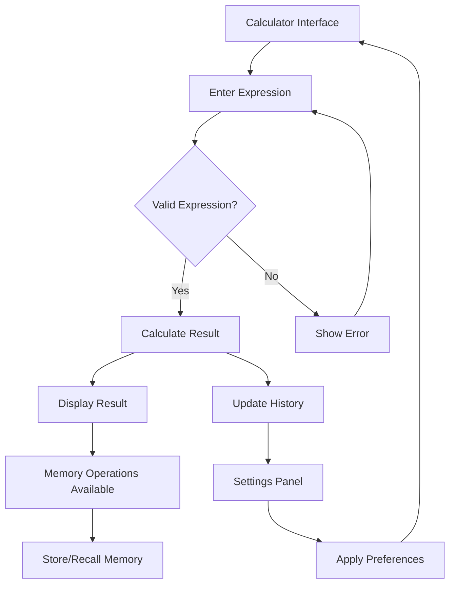

# Engineering Calculator - Product Requirements Document

## 1. Product Overview

A comprehensive web-based engineering calculator designed for professionals, students, and engineers who need advanced mathematical computation capabilities. The application combines standard calculator functions with specialized engineering tools including trigonometric, logarithmic, and exponential operations.

This calculator solves the problem of complex mathematical calculations by providing an intuitive interface with professional-grade accuracy, supporting both basic arithmetic and advanced engineering functions with real-time calculation history and error handling.

## 2. Core Features

### 2.1 User Roles

| Role | Registration Method | Core Permissions |
|------|---------------------|------------------|
| General User | No registration required | Full calculator functionality, settings persistence |

### 2.2 Feature Module

The engineering calculator requirements consist of the following main pages:

1. **Calculator Interface**: Main calculator display, input area, function buttons, mode toggles
2. **Settings Panel**: Theme selection, angle mode settings, precision settings, keyboard shortcuts

### 2.3 Page Details

| Page Name | Module Name | Feature description |
|-----------|-------------|---------------------|
| Calculator Interface | Display Area | Show current input expression, display calculation history, show error messages, memory indicator |
| Calculator Interface | Basic Operations | Addition (+), subtraction (-), multiplication (×), division (÷), equals (=), clear (C), backspace |
| Calculator Interface | Advanced Functions | Trigonometric functions (sin, cos, tan), logarithmic functions (log, ln), exponential functions (e^x, 10^x), power functions (x^y, x^2, x^3), root functions (√, ∛, nth root) |
| Calculator Interface | Constants | Quick access to π (pi) and e (Euler's number) constants |
| Calculator Interface | Parentheses | Support for complex expressions with nested parentheses |
| Calculator Interface | Memory Functions | Memory store (MS), memory recall (MR), memory clear (MC), memory add (M+), memory subtract (M-) |
| Calculator Interface | Mode Controls | Toggle between degree/radian modes, toggle between scientific/engineering notation |
| Settings Panel | Theme Selection | Switch between light and dark themes, apply theme changes instantly |
| Settings Panel | Angle Mode | Set default angle mode (degrees/radians), persist user preference |
| Settings Panel | Precision Settings | Configure decimal places (0-10), scientific notation threshold |
| Settings Panel | Keyboard Shortcuts | Display and customize keyboard shortcuts for common operations |

## 3. Core Process

### User Operation Flow

1. **Basic Calculation Flow**: User enters numbers and operators → Calculator displays current expression → User presses equals → Calculator shows result and adds to history
2. **Advanced Function Flow**: User selects function type → Enters input value → Calculator computes result → Displays result with appropriate formatting
3. **Memory Operation Flow**: User performs calculation → Stores result in memory → Recalls memory value in new calculation → Memory indicator shows active status
4. **Settings Management Flow**: User opens settings → Adjusts preferences → Changes apply immediately → Preferences persist across sessions

## 4. User Interface Design

### 4.1 Design Style

**Color Scheme:**
- Primary: Deep blue (#2563eb) for main operations
- Secondary: Gray (#6b7280) for numbers and basic functions
- Accent: Orange (#f59e0b) for advanced functions
- Error: Red (#ef4444) for error states
- Success: Green (#10b981) for successful operations

**Typography:**
- Primary font: Inter or system sans-serif
- Display font size: 2rem for main display
- Button font size: 1rem for function labels
- History font size: 0.875rem for secondary information

**Visual Elements:**
- Button style: Rounded rectangles with subtle shadows
- Layout: Grid-based button arrangement with logical grouping
- Animations: Smooth transitions for button presses and mode changes
- Icons: Minimalist line icons for functions and settings

### 4.2 Page Design Overview

| Page Name | Module Name | UI Elements |
|-----------|-------------|-------------|
| Calculator Interface | Display Area | Large LCD-style display with current expression at top, result below, history panel on right side, memory indicator in top corner |
| Calculator Interface | Button Grid | 6×5 grid layout with function buttons, color-coded by category, hover effects, active state indicators, responsive sizing |
| Calculator Interface | Mode Controls | Toggle switches for degree/radian mode, scientific notation toggle, positioned above main button area |
| Settings Panel | Settings Form | Clean card-based layout with form controls, save/cancel buttons, collapsible sections for different settings categories |

### 4.3 Responsiveness

**Desktop-First Design Approach:**
- Primary layout optimized for desktop screens (1200px+ width)
- Responsive breakpoints: 768px (tablet), 480px (mobile)
- Touch interaction optimization for mobile devices
- Keyboard navigation support for accessibility
- Flexible grid system that adapts to screen size

**Mobile Adaptations:**
- Stacked button layout for smaller screens
- Collapsible history panel
- Touch-optimized button sizes (minimum 44px)
- Swipe gestures for history navigation
- Portrait/landscape orientation support