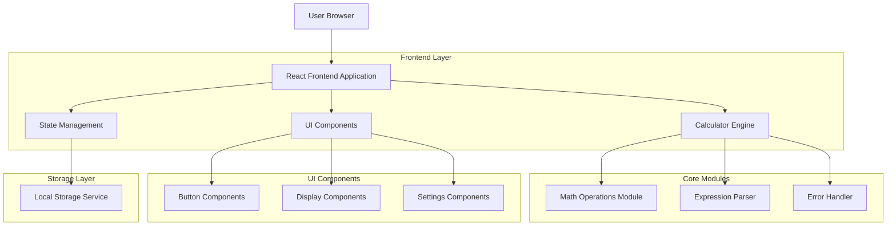
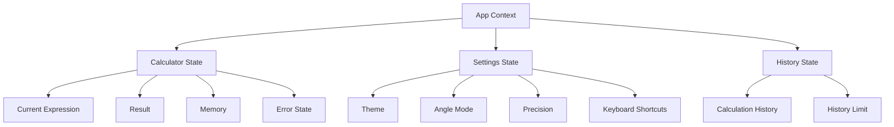

# Engineering Calculator - Technical Architecture Document

## 1. Architecture Design



## 2. Technology Description

**Frontend Stack:**
- Frontend: React@18 + TypeScript + Tailwind CSS@3 + Vite
- Initialization Tool: vite-init
- State Management: React Context API + useReducer
- Testing: Jest + React Testing Library
- Build Tool: Vite
- Package Manager: npm

**Key Dependencies:**
- mathjs@11 (for advanced mathematical operations)
- lucide-react (for icons)
- clsx (for conditional CSS classes)

**Development Tools:**
- ESLint + Prettier (code formatting)
- Husky (git hooks)
- TypeScript (type safety)

## 3. Route Definitions

| Route | Purpose |
|-------|---------|
| / | Main calculator interface with all functionality |
| /settings | Settings panel for theme, precision, and preferences |

## 4. Component Architecture

### 4.1 Core Components

**Calculator.tsx** - Main calculator container
```typescript
interface CalculatorProps {
  theme: 'light' | 'dark';
  angleMode: 'degrees' | 'radians';
  precision: number;
}
```

**Display.tsx** - Calculator display component
```typescript
interface DisplayProps {
  currentExpression: string;
  result: string;
  history: CalculationHistory[];
  memoryValue: number | null;
  error: string | null;
}
```

**ButtonGrid.tsx** - Calculator button layout
```typescript
interface ButtonGridProps {
  onButtonClick: (value: string) => void;
  buttonLayout: ButtonConfig[][];
}
```

### 4.2 Utility Modules

**CalculatorEngine.ts** - Core calculation logic
```typescript
interface CalculatorEngine {
  evaluateExpression(expression: string): number;
  parseExpression(expression: string): ParsedExpression;
  handleTrigonometric(func: string, value: number, mode: 'degrees' | 'radians'): number;
  handleLogarithmic(func: string, value: number): number;
  validateExpression(expression: string): ValidationResult;
}
```

**MemoryManager.ts** - Memory operations
```typescript
interface MemoryManager {
  store(value: number): void;
  recall(): number | null;
  clear(): void;
  add(value: number): void;
  subtract(value: number): void;
}
```

**ExpressionParser.ts** - Expression parsing and validation
```typescript
interface ExpressionParser {
  tokenize(expression: string): Token[];
  validate(tokens: Token[]): ValidationResult;
  convertToPostfix(tokens: Token[]): Token[];
  evaluatePostfix(tokens: Token[]): number;
}
```

## 5. State Management Architecture



## 6. Data Models

### 6.1 Core Interfaces

```typescript
interface CalculatorState {
  currentExpression: string;
  result: string;
  memory: number | null;
  error: string | null;
  isEvaluated: boolean;
}

interface SettingsState {
  theme: 'light' | 'dark';
  angleMode: 'degrees' | 'radians';
  precision: number; // 0-10
  scientificNotation: boolean;
  keyboardShortcuts: KeyboardShortcut[];
}

interface CalculationHistory {
  id: string;
  expression: string;
  result: string;
  timestamp: Date;
}

interface ButtonConfig {
  label: string;
  value: string;
  type: 'number' | 'operator' | 'function' | 'constant' | 'memory' | 'control';
  className?: string;
  onClick?: (value: string) => void;
}

interface ValidationResult {
  isValid: boolean;
  error?: string;
  suggestion?: string;
}
```

### 6.2 Button Layout Configuration

```typescript
const buttonLayout: ButtonConfig[][] = [
  [
    { label: 'sin', value: 'sin(', type: 'function' },
    { label: 'cos', value: 'cos(', type: 'function' },
    { label: 'tan', value: 'tan(', type: 'function' },
    { label: 'π', value: 'pi', type: 'constant' },
    { label: 'e', value: 'e', type: 'constant' }
  ],
  [
    { label: 'log', value: 'log10(', type: 'function' },
    { label: 'ln', value: 'log(', type: 'function' },
    { label: '√', value: 'sqrt(', type: 'function' },
    { label: 'x²', value: '^2', type: 'operator' },
    { label: 'xʸ', value: '^', type: 'operator' }
  ],
  // ... additional button configurations
];
```

## 7. Testing Strategy

### 7.1 Unit Tests
- Mathematical operation accuracy
- Expression parsing and validation
- Error handling edge cases
- Memory operations
- Theme switching functionality

### 7.2 Integration Tests
- Complete calculation workflows
- Keyboard navigation
- Responsive design breakpoints
- Accessibility compliance

### 7.3 Performance Tests
- Calculation speed benchmarks
- Memory usage optimization
- Large